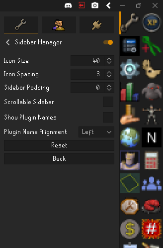
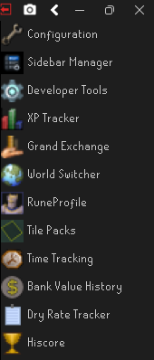
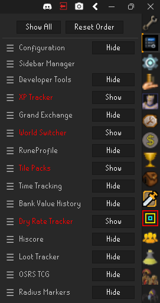

# Sidebar Manager

A RuneLite plugin for customizing and organizing the sidebar.

## Features

- Reorder sidebar plugins by dragging them into place
- Hide individual sidebar plugins and restore them when needed
- Save custom plugin order and hidden-plugin choices between sessions
- Resize sidebar icons and adjust their spacing and padding
- Show plugin names with left, center, or right alignment
- Use RuneLite's standard wrapping layout or a single-column scrollable sidebar
- Keep the managed plugin list updated as other plugins are enabled or disabled

### Bugs

- This is the first attempt at a runelite plugin, but it was one that I have wanted for a long time.
- There are likely to be bugs please report through github.
- I would love to hear any feedback through the github as well.
